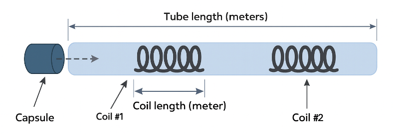
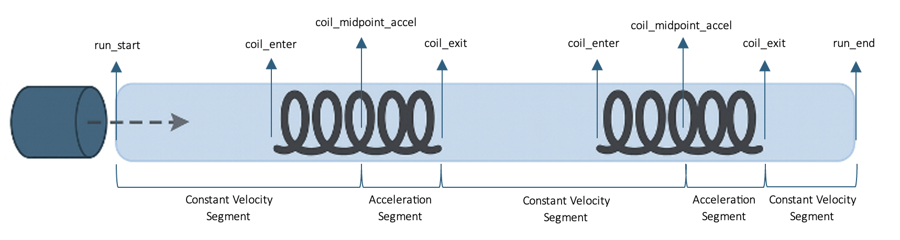

# Tube Capsule Model API

A physics simulation API for modeling capsule movement through tube systems with electromagnetic coils. 
This project provides a FastAPI-based REST API for creating, managing, and simulating the system.

## 🚀 Features

- **Physics-based Simulation**: Accurate modeling of capsule acceleration and constant velocity segments
- **RESTful API**: Complete CRUD operations for all system components
- **Real-time Simulation**: Generate detailed trajectory data including position, velocity, and acceleration over time
- **Energy Consumption Tracking**: Monitor energy usage by electromagnetic coils during acceleration phases
- **Compressed Results**: Automatic compression of simulation results for efficient data transfer
- **Interactive Documentation**: Built-in Swagger UI and ReDoc documentation

## 🏗️ System Components

### Core Entities

- **Tube**: The transport tunnel with a defined length
- **Capsule**: The transport vehicle with mass and initial velocity properties
- **Coil**: Electromagnetic acceleration coils with configurable force applied on capsule within a defined length
- **System**: Combines a tube, capsule, and positioned coils into a complete transport system
- **Segments**: Individual simulation segments representing different phases of capsule movement



### Model Behavior

1. The simulation is 1D
2. Acceleration starts at the midpoint of a coil and continues until its end
3. Capsule moves at constant velocity outside coils
4. Coils apply constant force
5. One capsule per simulation run
6. Ignoring friction (coil force is the only force applied)
7. Assuming a single user issues only one API request at a time.

### Simulation Flow

Capsule starts at the tube entrance at t0 = 0 and moves left to right at its initial constant velocity.
Capsule passes through coils in order of their positions.
Upon reaching a coil’s center, the coil’s configured force is applied on the capsule, causing acceleration.
Acceleration continues until the capsule exits the coil.
After exiting, it maintains the velocity reached at that moment until the next coil or the end of the tube.

The simulation divides capsule movement into discrete segments.
If the tube contains no coils, it is treated as a single constant velocity segment from start to end.
For tubes with coils, the segmentation follows this pattern:
1.	First segment (constant velocity): From the tube's beginning (position 0) to the midpoint of the first coil.
2.	For each coil, two segments are created:

    •	Acceleration segment: From the coil's midpoint to the coil's end, where the capsule accelerates due to the coil's force.
    
    •	Constant velocity segment: From the coil’s end to either the midpoint of the next coil (if it exists) or to the tube’s end (for the last coil).




## 📋 Prerequisites

- Python 3.8+
- pip package manager

## 🛠️ Installation

1. **Clone the repository**:
   ```bash
   git clone <repository-url>
   cd tube-capsule-model
   ```

2. **Install dependencies**:
   ```bash
   pip install fastapi uvicorn pydantic
   ```

## 🚀 Quick Start

### Start the Server

**Option 1: Using the run script (recommended)**
```bash
python run_server.py
```

**Option 2: Direct execution**
```bash
python main.py
```

**Option 3: Using uvicorn directly**
```bash
uvicorn main:app --host 0.0.0.0 --port 8000 --reload
```

### Access the API

Once running, the API will be available at:

- **API Root**: http://localhost:8000
- **Interactive Documentation (Swagger UI)**: http://localhost:8000/docs
- **Alternative Documentation (ReDoc)**: http://localhost:8000/redoc

## 📚 API Endpoints

### Tubes
- `POST /tubes/` - Create a new tube
- `GET /tubes/{tube_id}` - Get tube by ID
- `PUT /tubes/{tube_id}` - Update tube
- `DELETE /tubes/{tube_id}` - Delete tube
- `GET /tubes/` - List all tubes

### Capsules
- `POST /capsules/` - Create a new capsule
- `GET /capsules/{capsule_id}` - Get capsule by ID
- `PUT /capsules/{capsule_id}` - Update capsule
- `DELETE /capsules/{capsule_id}` - Delete capsule
- `GET /capsules/` - List all capsules

### Coils
- `POST /coils/` - Create a new electromagnetic coil
- `GET /coils/{coil_id}` - Get coil by ID
- `PUT /coils/{coil_id}` - Update coil
- `DELETE /coils/{coil_id}` - Delete coil
- `GET /coils/` - List all coils

### Systems
- `POST /systems/` - Create a new system
- `GET /systems/{system_id}` - Get system by ID
- `PUT /systems/{system_id}` - Update system
- `DELETE /systems/{system_id}` - Delete system
- `GET /systems/` - List all systems

### Simulation
- `POST /simulation/` - Run physics simulation and download results

## 🔬 Usage Example

### 1. Create System Components

**Create a Tube**:
```bash
curl -X POST "http://localhost:8000/tubes/" \
  -H "Content-Type: application/json" \
  -d '{"length": 5.0}'
```

**Create a Capsule**:
```bash
curl -X POST "http://localhost:8000/capsules/" \
  -H "Content-Type: application/json" \
  -d '{"mass": 1.0, "initial_velocity": 0.5}'
```

**Create Coils**:
```bash
curl -X POST "http://localhost:8000/coils/" \
  -H "Content-Type: application/json" \
  -d '{"length": 0.3, "force_applied": 10}'
```

### 2. Create a System

```bash
curl -X POST "http://localhost:8000/systems/" \
  -H "Content-Type: application/json" \
  -d '{
    "tube_id": 1,
    "capsule_id": 1,
    "coil_ids_to_positions": [
      {"coilId": 1, "position": 0.5},
    ]
  }'
```

### 3. Run Simulation

```bash
curl -X POST "http://localhost:8000/simulation/" \
  -H "Content-Type: application/json" \
  -d '{"system_id": 1}' \
  --output simulation_result.json.gz
```

The simulation returns a compressed JSON file containing:
- Complete position vs. time trajectory points
- Velocity vs. time trajectory points
- Acceleration vs. time trajectory points
- Coil engagement logs with energy consumption data
- Summary statistics (total travel time, max velocity, final velocity)

## 📊 Simulation Output

The simulation generates comprehensive trajectory data:

```json
{
  "success": true,
  "result": {
    "system_id": 2,
    "system_details": [
      {
        "tube": {
          "id": 3,
          "length": 5.0
        },
        "capsule": {
          "id": 3,
          "mass": 1.0,
          "initial_velocity": 0.5
        },
        "coils": [
          {"id": 3, "length": 0.3, "force_applied": 10.0, "position": 0.5}
        ]
      }
    ],
    "total_travel_time": 5.190295951692362,
    "final_velocity": 1.8027756377319946,
    "position_vs_time_trajectory": [
        {"time": 0.0, "position": 0.0},
        {"time": 1.3, "position": 0.65},
        {"time": 3.760018387919162, "position": 5.0}
    ],
    "velocity_vs_time_trajectory": [
        {"time": 0.0, "velocity": 0.5},
        {"time": 1.3, "velocity": 1.8027756377319946},
        {"time": 3.760018387919162, "velocity": 1.8027756377319946}
    ],
    "acceleration_vs_time_trajectory": [
        {"time": 0.0, "acceleration": 0.0},
        {"time": 1.3, "acceleration": 10.0},
        {"time": 3.760018387919162, "acceleration": 0.0}
    ],
    "coil_engagement_logs": [
        {"t_s": 0.0, "event": "run_start", "position_m": 0.0, "velocity_mps": 0.5, "acceleration_mps2": 0.0, "force_applied_n": 0.0, "energy_consumed_j": 0.0},
        {"t_s": 1.0, "event": "coil_enter", "coil_id": 3, "position_m": 0.5, "velocity_mps": 0.5, "acceleration_mps2": 0.0, "force_applied_n": 0.0, "energy_consumed_j": 0.0},
        {"t_s": 1.3, "event": "coil_midpoint_accel", "coil_id": 3, "position_m": 0.65, "velocity_mps": 0.5, "acceleration_mps2": 10.0, "force_applied_nN": 10.0},
        {"t_s": 1.4303, "event": "coil_exit", "coil_id": 3, "velocity_mps": 1.8027756377319946, "acceleration_duration_s": 0.13027756377319946, "acceleration_segment_length_m": 0.15, "energy_consumed_j": 1.5},
        {"t_s": 3.76, "event": "run_end", "velocity_mps": 1.8027756377319946, "tube_length_m": 5.0}
    ]
  }
}
```

## 🏛️ Architecture

### Project Structure

```
tube-capsule-model/
├── app/
│   ├── data/                   # JSON-based data storage
│   ├── domain/
│   │   ├── entities/           # Core business objects
│   │   ├── schemas/            # Pydantic data models
│   │   ├── services/           # Business logic layer
│   │   └── utils/              # Physics calculations & utilities
│   └── routers/                # FastAPI route handlers
├── main.py                     # FastAPI application setup
├── run_server.py               # Development server launcher
└── requirements.txt            # Project dependencies
```

### Design Patterns

- **Domain-Driven Design**: Clear separation of entities, services, and schemas
- **Repository Pattern**: File-based data persistence using JSONL format
- **Service Layer**: Business logic abstraction from API endpoints
- **Physics Engine**: Modular physics calculations for realistic simulation

## 🔧 Configuration

### Data Storage

The application uses JSONL (JSON Lines) files for data persistence:
- `app/data/tube.jsonl` - Tube definitions
- `app/data/capsule.jsonl` - Capsule specifications  
- `app/data/coil.jsonl` - Electromagnetic coil data
- `app/data/system.jsonl` - Complete system configurations
- `app/data/logs/` - Simulation execution logs

### Physics Parameters

Key physics calculations include:
- **Acceleration**: F = ma (Force = mass × acceleration)
- **Kinematic equations**: For position, velocity, and time relationships
- **Energy consumption**: Work = Force × Distance for each coil activation

## 🔮 Future Enhancements

- Database integration (PostgreSQL/SQLite)
- WebSocket support for real-time simulation streaming
- 3D visualization of capsule trajectories
- Advanced physics models (air resistance, magnetic field interactions)
- Multi-capsule system simulations
- Performance optimization for large-scale systems 